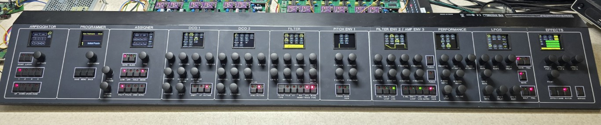

# Much More

A polyphonic 12 voice bi-timbral synthesizer based on the 6 voice cards I designed earlier.

This is the controller panel and assigner for the voice cards which are self contained and fully MIDI controlled.

The controller talks to two voice boards on seperate MIDI outputs, each voice board is identical so commands are common between them and only the output it is sent on determines which voice card responds.

The displays are also updated on a seperate MIDI output and are updated when layers are switched or parameters are changed. In general only the rotary controls are shown in the displays as the button LEDs show the status of the buttons.

All knobs are encoder based so continually variable, hence no legend.

Screens update in yellow for lower layer and cyan for the upper layer.

The main Teensy 4.1 based controller is held within this repository, but the voice board controller and the DCO's are held in other repositories.

# 6 voice board controller etc

https://github.com/craigyjp/6-Voice-card-controller-DACs-and-ShiftRegisters

# DCO source code etc

https://github.com/craigyjp/Simple-Pico-2-RP2350-based-dual-DCO-with-i2s-Audio

# Display boards 0-9

https://github.com/craigyjp/Much-More-Displays
